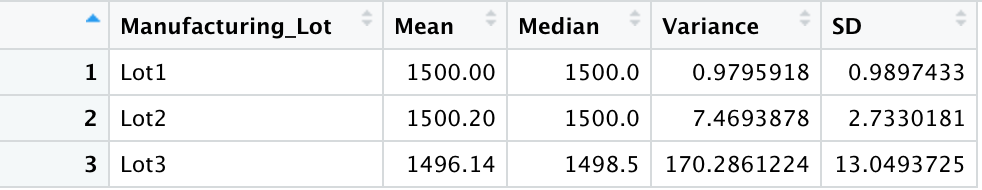

# MechaCar_Statistical_Analysis
## Overview of the project
The purpose of the project is to perform statistical test using R programming language for a special project of the AutosRUs' new car protoptype, the MechaCar. The project consists of four tasks:
1. Perform multiple linear regression analysis to identify which variables in the dataset predict the mpg of MechaCar prototypes.
2. Collect summary statistics on the pounds per square inch (PSI) of the suspension coils from the manufacturing lots.
3. Run t-tests to determine if the manufacturing lots are statistically different from the mean population.
4. Design a statistical study to compare vehicle performance of the MechaCar vehicles against vehicles from other manufacturers. For each statistical analysis, I’ll write a summary interpretation of the findings.

## I. Linear Regression to Predict MPG

* #### Which variables/coefficients provided a non-random amount of variance to the mpg values in the dataset?
In the summary output, each Pr(>|t|) value represents the probability that each coefficient contributes a random amount of variance to the linear model. According the results, vehicle_length and ground_clearance are statistically unlikely to provide random amounts of variance to the mpg values because these two variables have a significant impact on the mpg values.   

* #### Is the slope of the linear model considered to be zero? Why or why not?
The slope of the linear model is not considered to be zero, because the p-value of the linear regression analysis is 5.35 x 10-11, which is much smaller than our assumed significance level of 0.05%. Therefore, we can state that there is sufficient evidence to reject the null hypythesis, which means the slope of the linear model is not zero. 
* #### Does this linear model predict mpg of MechaCar prototypes effectively? Why or why not?
According to the summary output, the r-squared value is 0.7149, which means 71.49% of the dependent variable variation is explained by the linear regression model. The r-squared value proves that the linear model does precidt mpg of MechaCar prototypes effectively. 

## II. Summary Statistics on Suspension Coils
The overall variance for all manufacturing lots is 62.29, which indicates that the current manufacturing data meets the limitation of 100 pounds per square inch requirement. 

When looking into the lot summary of each lot separately, the first lot has a variance of 0.98 and the second lot has a variance of 7.47, both of them meet the design specification. But, the third lot has a variance of 170.29, which greatly exceeds the limitaton of 100 pounds per squre inch specification. Therefore, the third lot does not meet the suspension coils design requirement. 

## III. T-Tests on Suspension Coils
### 1.  A t-test is carried out to determine if the PSI across all manufacturing lots is statistically different from the population mean of 1,500 pounds per square inch.

The p-value is 0.06, which is above the significance level of 0.05. Therefore, there is not enough evidence to reject the null hypothesis and we can confirm that the PSI across all manufacturing lots is statistically similar to the population mean of 1,500 pounds per square inch.

### 2. Three more t.tests are created by using t.test() function and its subset() argument to determine if the PSI for each manufacturing lot is statistically different from the population mean of 1,500 pounds per square inch.

The p-value for lot 1 t-test is 1, which is not only greater than the significance level of 0.05, but also indicates that the observed sample mean perfectly described by the population mean (1500). Therefore, we do not have enough evidence to reject the null hypothesis and would state that the two means are statistically equal. 

The p-value for lot 2 t-test is 0.61, which is greater than the significance level of 0.05. Therefore, we do not have enough evidence to reject the null hypothesis and would state that the two means are statistically similar. 

The p-value for lot 3 t-test is 0.04, which is lower than the significance level of 0.05. Therefore, we would have sufficient evidence to reject the null hypothesis and state that the two means are statistically different. 

## IV. Study Design: MechaCar vs Competition
As gas price spikes, consumers consider the fuel efficiency as an important factor when purchasing a car. Therefore, conducting a statistical study on the fuel efficiency to analyze the MechaCar's performance against the competition models would provide more insights for AutosRUs's product development team. 
* Metrics
    * Fuel efficiency 
    * Road type (city, highway)
    * Drive stystem (2WD, 4WD)
* Hypothesis
    * H0: The means of fuel efficiency of all vehicles in the class are equal.
    * Ha: At least one of the vehicles in the class has a different mean of fuel efficiency.
* Statistical test
    * A two-way ANOVA test is used to determine if there is any statistical difference in the fuel efficiency based on the drive system and road type. The reason we choose a two ANOVA test is because we compare the means across more than two groups and have two different independent variables.
* Data needed
    * Collect datasets from MechaCar and comparable models from other manufacturers.
    * The dependent variable (Fuel efficiency) data is numerical, continuous, and normally distributed.
    * The two independent variables (Road type annd Drive system) are categorical as shown in the above metrics description. 